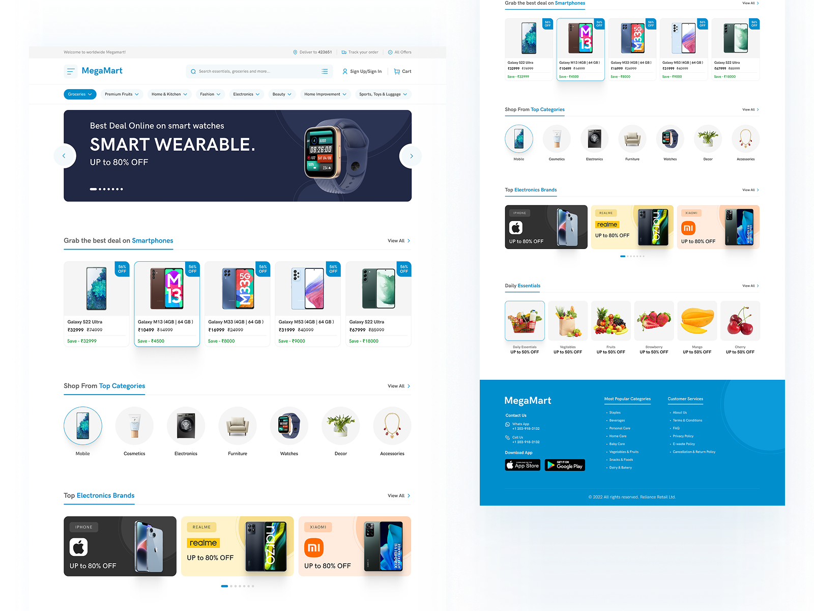

# React + TypeScript + Vite

This template provides a minimal setup to get React working in Vite with HMR and some Oxlint rules.

Currently, two official plugins are available:

- [@vitejs/plugin-react](https://github.com/vitejs/vite-plugin-react/blob/main/packages/plugin-react) uses [Oxc](https://oxc.rs)
- [@vitejs/plugin-react-swc](https://github.com/vitejs/vite-plugin-react/blob/main/packages/plugin-react-swc) uses [SWC](https://swc.rs/)

## React Compiler

The React Compiler is not enabled on this template because of its impact on dev & build performances. To add it, see [this documentation](https://react.dev/learn/react-compiler/installation).

## Expanding the Oxlint configuration

If you are developing a production application, we recommend enabling type-aware lint rules by installing `oxlint-tsgolint` and editing `.oxlintrc.json`:

```json
{
  "$schema": "./node_modules/oxlint/configuration_schema.json",
  "plugins": ["react", "typescript", "oxc"],
  "options": {
    "typeAware": true
  },
  "rules": {
    "react/rules-of-hooks": "error",
    "react/only-export-components": ["warn", { "allowConstantExport": true }]
  }
}
```

See the [Oxlint rules documentation](https://oxc.rs/docs/guide/usage/linter/rules) for the full list of rules and categories.

## Samples Design Theme



## MegaMart Figma Design
* [MegamartUIFigma](./highFidelityDesignAllPages/MegaMart.png)
* [HomePage](./highFidelityDesignAllPages/HomePage.png)
* [ProductSearchAndCatalogListingPage](./highFidelityDesignAllPages/ProductSearchAndCatalogListingPage.png)
* [ProductDetailsPage](./highFidelityDesignAllPages/ProductDetailsPage.png)
* [ShoppingCardAndCheckOutPage](./highFidelityDesignAllPages/ShoppingCardAndCheckoutPage.png) 
* [AuthenticationPage](./highFidelityDesignAllPages/AuthenticationPages(LoginAndRegister).png)
* [CustomerOrderHistoryPage](./highFidelityDesignAllPages/CustomerOrderHistoryPage.png)
* [AdminDashBoardPage](./highFidelityDesignAllPages/AdminDashBoardPage.png)

## Repository File Structure
```
  megamart-frontend/
├── public/
├── src/
│   ├── assets/
│   │   └── styles/
│   │       └── custom-bootstrap.scss # Custom MegaMart theme overrides (#008ECC)
│   ├── types/
│   │   └── index.ts               # Database Entity Models
│   ├── mock/
│   │   └── mockData.ts            # Local Mock Database
│   ├── store/
│   │   ├── store.ts               # Redux Store Config
│   │   ├── hooks.ts               # Typed Redux Hooks
│   │   └── slices/
│   │       ├── authSlice.ts       # User entity state & login mock
│   │       ├── categorySlice.ts   # Category entity state
│   │       ├── productSlice.ts    # Product entity state
│   │       └── orderSlice.ts      # Order & OrderItem checkout state
│   ├── components/
│   │   ├── Header.tsx             # Navbar & Search Bar
│   │   ├── Footer.tsx             # Site Footer
│   │   ├── CategoryNav.tsx        # Horizontal Category Pills
│   │   └── ProductCard.tsx        # Bootstrap Product Card
│   ├── pages/
│   │   ├── HomePage.tsx           # Page 1: Deals & Categories
│   │   ├── LoginPage.tsx          # Page 2: Auth (Login/Register)
│   │   ├── ProductListPage.tsx    # Page 3: Search & Filters Catalog
│   │   ├── ProductDetailPage.tsx  # Page 4: Specific Product View
│   │   ├── CartPage.tsx           # Page 5: Shopping Cart & Checkout
│   │   ├── OrderHistoryPage.tsx   # Page 6: Customer Orders
│   │   └── AdminDashboardPage.tsx # Page 7: Admin CRUD Console
│   ├── App.tsx                    # Routes & Layout Container
│   └── main.tsx                   # React Root & Provider
├── package.json
└── tsconfig.json
```